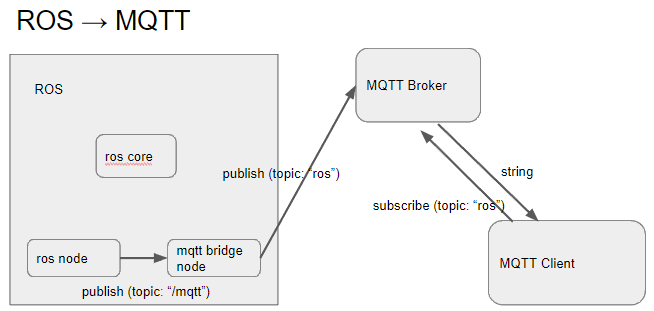

# mqtt_bridge

mqtt_bridge provides a functionality to bridge between ROS and MQTT.




## Run

### prepare MQTT broker and client

```
$ sudo apt-get install mosquitto mosquitto-clients
```

### Install python modules

```bash
$ pip install -r requirements.txt
```

### launch node

``` bash
$ roslaunch mqtt_bridge ssg.launch
```

### test

Subscribe mqtt topic `ros`,

```
$ mosquitto_sub -h 127.0.0.1 -t 'ros'
```

Publish to `/mqtt`,

```
$ rostopic pub /mqtt std_msgs/String 'data: "{\"cart\": \"cart1\", \"battery\": 70}"'
```

and see mqtt response.

```
{"cart": "cart1", "battery": 70}
---
```

## License

This software is released under the MIT License, see LICENSE.txt.
